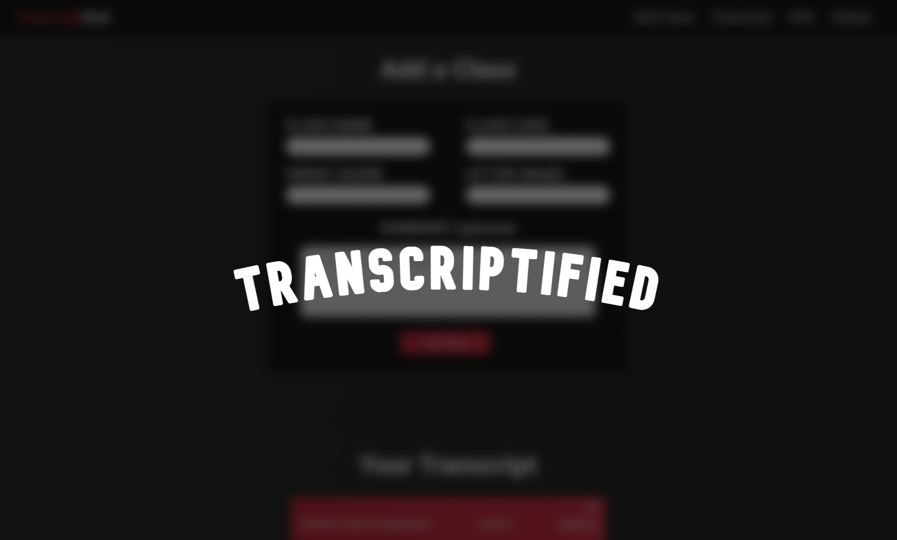

# Transcriptified

## Contributor
Jake Shoffner ([Jxk0be](https://github.com/Jxk0be))

## About Transcriptified
An alternative transcript experience that enables the user to add notes to their courses and has more flare than typical school transcripts.

## How to Access
To access the web app, it is [hosted here](https://github.com/Jxk0be). 

This uses local storage instead of a database, so **make sure to not clear browser data** or you will lose your previous input.

## How to Use
In order to use, fill out all input fields. If not done correctly, error-checks will notify you of your problem.

## License
[LICENSE](LICENSE)